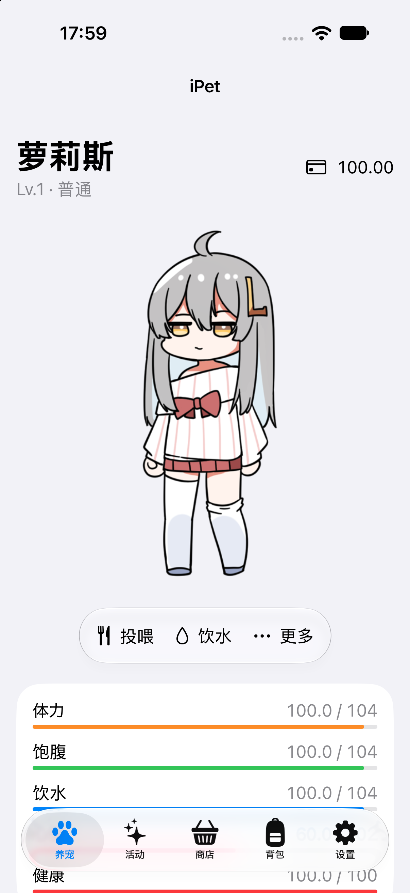
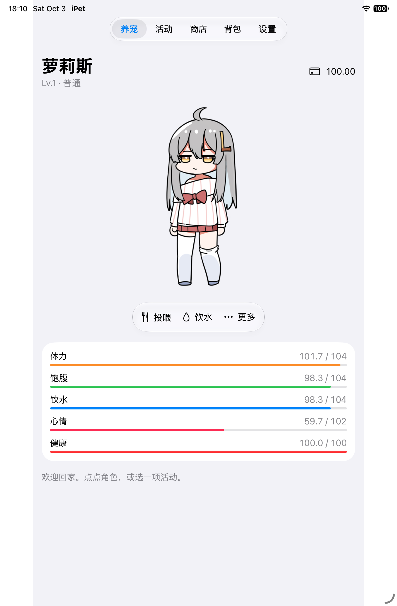

# iOS / iPadOS 原生首版

最低支持26，使用SwiftUI原生导航和Liquid Glass控件。角色固定在应用内展示，动画、摸头/身体互动、免费食水、休息、13项活动和118项物品规则复用共享模块；无桌面窗口和自主移动。当前为源码与自用Simulator构建，尚未签名/发行，不代表真机或26系统验收。

实际启动截图（iOS27 Simulator，非真机）：

 

## 构建与运行

需要macOS26+、Xcode26+ / Swift6和iOS Simulator runtime。先执行 `python3 Apple/scripts/create_project.py`，再执行 `bash Apple/scripts/build-ios.sh`，输出 `Apple/build/iOS/Build/Products/Release-iphonesimulator/iPet-iOS.app`。Xcode打开 `Apple/iPet.xcodeproj`，选择共享scheme `iPet-iOS` 和已安装iPhone/iPad模拟器，运行即可；macOS scheme仍为 `iPet`。

`bash Apple/scripts/test-ios.sh` 自动选取一个iOS26及以上的可用iPhone模拟器，运行隔离的应用模型与界面测试。可设置 `IPET_IOS_TEST_DEVICE_ID` 指定设备ID。`bash Apple/scripts/verify.sh` 运行共享Swift/Python测试、双平台应用构建、iOS模型/界面测试、资源/图标/许可/工程检查与本地签名验证；Simulator或SDK缺失是环境失败，不应省略检查后宣称通过。共享模块scratch为 `build/ios-shared`，应用DerivedData为 `build/iOS`，避免两种构建混用缓存。

真机运行：在Xcode的iOS应用Signing & Capabilities选择自己的开发团队，连接iPhone/iPad并启用必要的开发者模式，然后选择设备运行。仓库没有团队ID、签名证书、描述文件或用户凭证。Simulator包不能直接安装到真机，也不是App Store发行包。

## 页面与行为

养宠页的角色可轻点原摸头/身体区域，透明处不互动；“更多”展开休息/起床、摸头与聊天。浮动控件使用原生玻璃材质与连续形变，“减少动态效果”时弱化展开动画。状态与商品内容保持实色清晰层，较大字号下操作区改为纵向布局。

活动页展示工作/学习/娱乐、等级限制、收益、进度和暂停/继续/停止；活动中循环重选已有变体，停止播放结束阶段。商店支持搜索、购买即用/入包；背包保留数量和原物品参数，用后播放真实贴图；未识别库存显示ID、数量和不可用说明，搜索无结果与真实空背包区分。设置可调整本机字体、字号、透明度、播放速度、停留倍率、自动消息，包含预览和来源/许可页。预览不结算养成奖励。

仅前台活跃推进；每60秒、关键互动/经济操作和退出活跃状态保存。后台/锁屏/退出不补算，恢复重建时间基准。加载已有活动仍暂停，需主动“继续”。保存失败暂停规则、消息奖励和操作，重试成功后恢复，不补算失败间隔。规则、金币和JSONv9保持共用，不为iOS另写养成公式。

## 存档、错误与恢复

存档在应用沙盒 `Library/Application Support/iPet/` 的 `pet.json`，上一份有效备份为 `pet.previous.json`；与macOS目录独立，无云同步。删除应用可能删除这些本地数据，首版尚无应用内文件导出/导入界面；重要数据可在卸载前通过Xcode下载应用容器备份。

损坏主档保留为 `pet.corrupt-UUID.json`，尝试已有备份；未来版本或不可读存档显示启动错误且不写新档覆盖。资源启动失败显示错误页。遇到写入失败，保留当前进程，检查剩余空间/沙盒状态后点“重试保存”；不提供静默重置按钮。开发回滚通过Git恢复工程和代码重建，不删除沙盒，不降级JSON。

## 验证边界与后续

本轮记录iPhone18Pro / iPad mini(A17Pro) Simulator、iOS27、macOS27/Xcode27环境。本轮[全面排查](IOS-DEBUG-AUDIT-2026-10-03.md)补查iPhone左右横屏/竖屏与iPad四方向的设置预览，以及基本操作、库存和恢复。模型与模拟器操作不等于真实触摸与所有动画视觉验收；26运行时、真机、其余页面方向布局、大字号、减少透明度、前后台系统挂起和长期内存/性能仍要逐项补验。不会把iOS27截图当成iOS26或实机证据。

暂缺iOS排程/套餐/统计明细/旧档兼容及文件导出恢复界面；共享模块有能力不等于页面已迁移。角色加载交给未来独立petloader；当前不做多角色/MOD、云存档、联机、语音/AI、全局键盘宏、Steam或通知/小组件。许可文件随应用资源打包，新iOS图标为现有像素风图标的imagegen版式适配，不改变角色动画授权。
